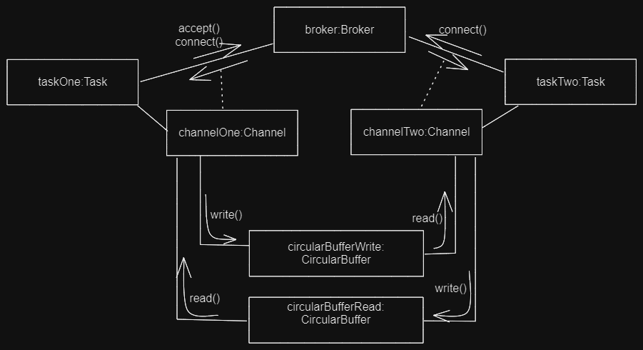

## Broker - Channel

1.	**Spécifications**
Le Broker-Channel c'est une bibliothèque destinée à l'envoie et la reception des bytes. Il assure également
une communication bidirectionnel.
La classe Broker permet d'autoriser les connexions et de se connecter à ce dernier pour créer des connexions.
Un Channel permet l'envoie et la réception de bytes.
Une fonction d’acceptation (accept) permet d'ouvrir un port pour la connexion à un 
Broker et en générant un nouveau MessageQueue pour les échanges. Cette méthode est bloquante pour 
attendre d'éventuelles connexions.Une fonction de connexion (connect) permet de demander la connexion sur le port (int port) d’un
QueueBroker précis (string name) et renvoi donc un MessageQueue. Cette fonction est également bloquante en attente 
d'autorisations de connexion.
Les méthodes read et write permettent l'envoie et la reception des bytes. ces méthodes sont bloquantes
Il est préférable de fermer la connexion une fois les messages échangés afin de laisser le port libre
pour d’autres accès, la fonction disconnect() permet cette fermeture de connexion. La communication est monothreadé

2.	**Design**
La communication est monothreadé et est réalisée en utilisant deux objets de la classe Task 
(la classe Task étends la classe Thread) . Ces instances de la classe Task possède un objet Broker 
partagé et s'éxécutent sur un mm processus linux. La première tâche autorise des connexions sur un port 
donné en utilisant la méthode accept(port) du Broker, et est bloquée jusqu'à la prochaine connexion
Les autres tâches se connectent en utilisant le nom et le numéro de port de la connexion ouverte 
précédemment Un objet Channel est associé à chaque tâche, soit 2 instances Channel au total. 
Les deux instances de la classe Channel se partagent deux buffers croisés correspondant à des 
instances de la classe CircularBuffer.

3.	**Implémentation**

voir le dossier **TD1/brokers** et **TD1/channels** et **TD1/tâches** 
et le point principal pour l'execution est le fichier **Main.java**

*Il suffit de lancer l'execution du fichier Main.java via l'IDE pour avoir le résultat suivant :*

`accept 1

 Connect
 
 message reçu : Hello World!`
 
 Et l'implémentation marche bien pour deux tâches qui parviennent à communiquer
 
 
 ## Broker - Channel (end)