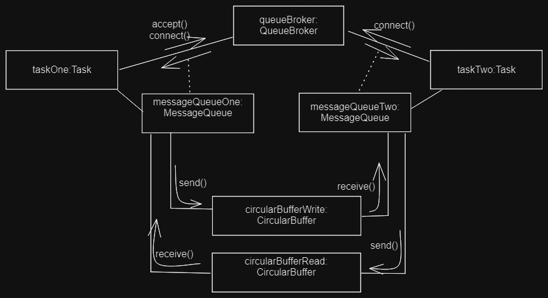

## MessageQueue

1.	**Spécifications**
Message Queues c'est une bibliothèque destinée à l'envoie et la reception des messages. Il assure également
une communication bidirectionnel.
Un message est un ensemble de bits de taille variable qui est envoyé par l'initiateur et reçu par d'autre
La classe QueueBroker permet d'autoriser les connexions et de se connecter à ce dernier pour créer des connexions.
Un **MessageQueue** permet l'envoie et la réception de messages sous forme de bytes.
Une fonction d’acceptation (accept) permet d'ouvrir un port pour la connexion à un 
QueueBroker et en générant un nouveau MessageQueue pour les échanges. Cette méthode est bloquante pour 
attendre d'éventuelles connexions.Une fonction de connexion (connect) permet de demander la connexion sur le port (int port) d’un
QueueBroker précis (string name) et renvoi donc un MessageQueue. Cette fonction est également bloquante en attente 
d'autorisations de connexion.
Les méthodes send et receive permettent l'envoie et la reception des messages. ces méthodes ne sont pas bloquantes
Il est préférable de fermer la connexion une fois les messages échangés afin de laisser le port libre
pour d’autres accès, la fonction closed() permet cette fermeture de connexion.
La communication est multithreadé

2.	**Design**
La communication est multithreadé et est réalisée en utilisant plusieurs objets de la classe Task 
(la classe Task étends la classe Thread) . Ces instances de la classe Task possède un objet QueueBroker 
partagé et s'éxécutent sur un mm processus linux. La première tâche autorise des connexions sur un port 
donné en utilisant la méthode `accept(port)` du queueBroker, et est bloquée jusqu'à la prochaine connexion
Les autres tâches se connectent en utilisant le nom et le numéro de port de la connexion ouverte 
précédemment Un objet MessageQueue est associé à chaque tâche, soit n instances MessageQueue au total. 
Les N instances de la classe MessageQueue se partagent deux buffers croisés correspondant à des 
instances de la classe CircularBuffer.

3.	**Implémentation**

voir le dossier **TD2/brokers** et **TD2/channels** et **TD2/tâches** 
et le point principal pour l'execution est le fichier **Main.java**

*Il suffit de lancer l'execution du fichier Main.java via l'IDE pour avoir le résultat suivant :*

`accept 1

 Connect
 
 message reçu : Hello World!`
 
 Et l'implémentation marche bien pour deux tâches qui parviennent à communiquer
 
 
 ## MessageQueue (end)